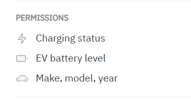
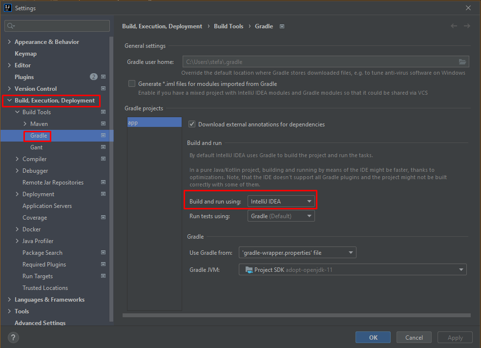

# smart-charging

## 14.7.2022
- Created Git-Repository
- Created Test File for HTTP-Request

## 15.7.2022
- HTTP-Request on Test-API
- Read the documentation and made simple requests
- Studied the Loxone api

## 18.07.2022
- Noticed that we had not to do the "Setting up a connection" task
  under the Link:   
  https://www.loxone.com/dede/wp-content/uploads/sites/2/2022/06/1300_Communicating-with-the-Miniserver.pdf
   
  We started to take a cloer look into the Loxone "lxcommunicator" Folders  
  that we downloaded from GitHub under:  
  https://github.com/Loxone/lxcommunicator  
  We made the steps under this Link. Before we had to download "node.js" for Windows to use it in CLion.  
  https://nodejs.org/en/download/
- In the next step we dealt with where we put the URL in the test example.
    After a long search we found it in the "index.js" in the test folder on line 67.
    There we then changed the URl to the hostname and the username and password
  that of the mini server.
- We talked to an internal software developer how best to do it now
  should do. We found out that the "lxcommunicator" is superfluous there
  For starters, we only send data from Aichhorn to its BMW cloud connection via a simple
  HTTPS request should be sent to a digital input (in the Loxone-Config).  
>- Request: https://[host+port]/jdev/sps/io/[name]/[value]
>- Or when the above-mentioned link does not work use the following link: 
   https://dns.loxonecloud.com/[seriennummer]/jdev/sps/io/[name]/[value]
- The next step is to add a few digital inputs to the Loxone-Config and to simulate 
  the charge level and the remaining range
- We made a new site in the Loxone-Config and added a digital input that we named "Akkustand"
    which shows the percentage of the battery as a slider.
- We made a new folder named "communicationWithServer" in which we (task we have to
  do today or tomorrow) send a HTTPS-Request, as shown above, to the digital input
  to set his value.

## 19.07.2022
- We tried to get a connection, with the link mentioned above, in postman.
    The result: we got a 403 code which means:
    "403 Forbidden, if the element exists, but your user has no access (Loxone user permissions)"
- We tried to figure it out, we did not manage it until yet.

## 20.07.2022
- We started to test the link "https://dns.loxonecloud.com/[seriennummer]/jdev/sps/io/Akkustand/75"  
  in a browser, but we got the error "excess on dns.loxonecloud.com was denied".
- After talking with an external employee we found the problem.
    As expected our miniserver was not registered. To activate CloudDNS at Loxone  
  you <b>HAVE TO!!!</b> register your miniserver on their website.  
  --> after that you get automatically access to it and you can communicate with the link 
  mentioned above
- I tried it with the link mentioned above. 
    The result:  
  --> In Postman the url does not work but after unplugging the miniserver and changing the settings
    in the config in the "external connection"-section to "connection with REMOTE CONTROLL"
    I got asked in the browser to please enter my username and password and suddenly the slider
    named "Akkustand" got the value 75 which I sent in the url.
>- Responde from the browser:  {"LL": { "control": "dev/sps/io/Akkustand/75", "value": "75.000", "Code": "200"}}
    --> IT WORKS!!!

## 21.07.2022
- In school Mr. Tarta and Spahr tried to build a connection with the miniserver.
  They tried so many things but could not get a connection. They had to change the location.
  Meanwhile Mr. Aichhorn tried to implement some methods with which you can run a c++ application.
  He tried so many things but at the end it does not work. He spoke with our internal supervisor
  and now we can make it in Java. For the communication with the server, in Java, we made a new project
  loaded our old one from GitHub und made a new folder called "communicationWithServerJAVAVersion"
  in which we send a https-request to the server. We are also trying to send our login values
  within the url so we do not have to login manually anymore.
- Current status <b>NOW</b> httpsRequest.js puts out a html report.
- Now it says us a 401 code as expected because we have to authorize our self with the username
  and the password but we still do not know how to send them with the url in the correct way
  so the browser does not ask us anymore.

## 22.07.2022
- In the morning we got a new message from our internal supervisor because of the problem
  with the authentication on the miniserver.
- To get this going we have to do activate the following things in the "Settings"
  section, under the url of the request:
  1. Automatically follow redirects
  2. Follow original HTTP-Method
  3. Follow Authorization Header
- Then we have to go to the "Authorization" section and set the "Type" to "Basic Auth".
    --> Now we can set username and a password.
- After a little-bit of searching I found some code on stackoverflow to send
  the username and the password within the header of the request.
- The result: --> <b>It works perfectly</b>
    The battery level changes on the app and we do not have to type in the
  authentication information anymore. Everything runs automatically.
>-If we did not mentioned it to get the green run symbol in IntelliJ you have to
  run it first in the "Terminal":  <b>node httpsRequest.js</b>

## 25.07.2022
- We updated the project into our Clion folder. To run the Java-Version there you
  have to go into the terminal and download the "xhr2"-package with "npm install xhr2"
  now you have to go into the Java-version folder with "cd communicationWithServerJAVAVersion".
    --> now you can run it with "node httpsRequest.js".
- We started to implement the BMW CarData into our program to see if we can load
  the data from a test vehicle from BMW.
- We put the https-request-code into a function called <b>"setBatteryLevel([value])"</b>.
- we tried to execute the function with an interval of one second each time starting from
  zero to one hundred with a value increased by 1.
- Now after updating the project I got a message in the first line of my program called
  <b>"require is not defined"</b>. 
- I searched on Google and found these three ways on a website:
    "https://learn.coderslang.com/0021-nodejs-require-is-not-defined-error/"
- <b>Solution:</b>
   To get rid of the error require is not defined in Node.js you can do 3 things:
- 1. Change the type of modules in package.json to commonjs:  "type": "commonjs"
  2. Delete the string "type": "module" from the file package.json
  3. Change the require to import:
      // const express = require('express');
      import express from 'express';
- We had to choose the <b>third</b> method because with the first one the "api.js"-File
  in the "BMW-API"-folder would not work.
    We had to change the first line in the "httpsRequest.js"-File in the
  "communicationWithTheServerJAVAVersion"-folder:
    From: "<b>var XMLHttpRequest = require('xhr2');</b>"
    To: "<b>import XMLHttpRequest from 'xhr2';</b>"
- We found two BMW apis, one coming from BMW and another one uploaded to Github by a user. 
  For marketing reasons we had to choose the api made by BMW. The big disadvantage of the 
  BMW api is that it is chargeable and we need an account. So that we can create this, we 
  need the UID, which we will only receive after consultation with our supervisor.

## 26.07.2022
- We startetd downloading the BMW-i-remote software from GitHub. Reason why we do not use the original
  one from BMW is that you need to buy it and pay for it. The GitHub versions are free
  to use.
- There are two versions:
    1. https://github.com/mihaiblaga89/bmw-connecteddrive-api (JavaScript-version)
    2. https://github.com/edent/BMW-i-Remote#get-vehicle-data (Python-version)
- If you want to make a test vehicle you need to download the "my-BMW"-app:
    https://apps.apple.com/fi/app/my-bmw/id1519034860
    There you have to make a new account and then you can create a test vehicle.
    The reason is that you need the VIN from your car (thats something like your
  identify number from your vehicle).
- We made a new .js-File in which we try to make the tutorial from the bmw-connecteddrive-api.
    https://bmwapi.mihaiblaga.dev/ (Link for the usage of it)
- We had to install the "@mihaiblaga89/bmw-connecteddrive-api" into the "package.json"-File
  to get the import working. (Click on it and then click Alt+Enter, select the .json-File you
  want, done).
- ERROR at initializing the API:

## 27.07.2022
- Today we tried it again and unfortunately we got the same error as yesterday: 
    <b>Error: Request failed with status code 400</b>
- After researching we found out that something has to be wrong with the url
  they send in their version we downloaded, because in the internet 75 percent
  of the people wrote that maybe the way the email has to be sent has changed.
- After searching on GitHub we found something interesting:
    https://github.com/mihaiblaga89/bmw-connecteddrive-api/issues/200
    They noticed this issue back in November 2020 and fixed it.
- Now we have to find out how we get the issue fixed version.

## 28.07.2022
- We copied the whole package.json from GitHUB, but it also did not work.

##29.07.2022
- The next day. We decided to search for new ways to get the BMW i remote API.
- We found something interesting: https://smartcar.com/bmw/
    The only <b>PROBLEM</b> is that you have to pay for it.
- We found something on:
    https://www.goingelectric.de/forum/viewtopic.php?t=21224&start=370
    Where the user "rs38" said:
    "Since 10.12. BMW has at least screwed on the APIs that the (old) 
  IOS/Android apps used and nothing is like it was before.
  Specifically, the base URL "https://b2vapi.bmwgroup.com/*" was changed 
  to "https://myc-profile.bmwgroup.com/api/gateway/brs/*".".
- So we did in the "index.js" file after searching for the old URL in all
  project files. <b>We tried</b> it out and yeah we <b>got NOTHING back</b>
  No failure no success it is just loading in a loop.

## 26.08.2022
- Again trying to fix the problem with the version of the GitHub version.
- We tried to set the latest version from the "bmw-connecteddrive-api" which is
  0.5.4.
    In this version they changed some things (we think versions) od their
  dependencies.
- To set it up and install the latest version via "nmp install" we tried to
  set the link in the "package.json"
    From: "@mihaiblaga89/bmw-connecteddrive-api": "553994ad1a14a54765cc409f806eeb5cd53acd7c",
    To: "@mihaiblaga89/bmw-connecteddrive-api@0.5.4": "553994ad1a14a54765cc409f806eeb5cd53acd7c",
- As ALWAYS it did not work so we think we did something wrong with implementing
  the version.
- The URL where we found that: 
  https://github.com/mihaiblaga89/bmw-connecteddrive-api/pkgs/npm/bmw-connecteddrive-api/33221759
- After reading it again we found out that we used the wrong implementation.
- We HAD TO USE the "<> Install via package.json:" version so we changed the
  third line in the "package.json":
    From: "@mihaiblaga89/bmw-connecteddrive-api": "553994ad1a14a54765cc409f806eeb5cd53acd7c"
    To: "@mihaiblaga89/bmw-connecteddrive-api": "0.5.4",
- But that also did not work after installing it!
- We also tried to install the latest version of the "lxcommunicator", 
  "node-fetch" and "xhr2".

## 28.08.2022
- We started <b>A NEW THING!</b>
- We saw something interesting from "smartcar", the only problem is that
  it is <b>NOT free!</b> but otherwise we can not finish our thesis.
- To start the free trail we first have to go on their website:  
  https://smartcar.com/bmw/
- There we have to go on the "Log in"-button and fill out the grids.
- After finishing it we have to install the JavaScript SDK in the
  "Terminal" in IntelliJ:
    <b>npm install @smartcar/auth</b>
- First we had to clone the smartcar-sdk (in the Terminal) via:
    "git clone https://github.com/smartcar/getting-started-java-sdk.git"
- Now we got a new folder called "getting-started-java-sdk"
  (we had to setup a java version / e.g. 11.02)
- The full Tutorial (of the "Setup"-Step) is on:
    https://smartcar.com/docs/tutorials/java/setup/#1-sign-up-for-a-smartcar-account

## 29.08.2022
- Found out that the tutorial is ONLY to explain what they do with the code
  which is still in the "getting-started-java-sdk/app/src/main/java/Main.java".
- We copied the folder and renamed it to "...-sdk-copiedVersion" to be able to
  push it on GitHub.
- Now we have to find out how to run this .java file.

## 06.09.2022
- I started to make a new Java-Project with the same code because the code is planned
  for Java Projects.
- I made the "setup"-tutorial on the "smartcar"-website and failed at the fourth point.
  I got the error code: <b>Could not determine java version from '11.0.10'</b>
    So I had to fix that first.
- I called mister Rathgeb and he helped me fixing the problem. The problem was that
  there are two folders, two project in it and so the program could not know which
  one it has to open. So we had to open e.g. the "app" folder and then it made the
  .gradle build by itself. I only had to set up the jdk in my case the 11.02 version
  and now it is set up correctly and we can work on it.

## 02.10.2022
- Our team managed to get vehicle data with a node.js version of the
  smartcar - projekt. Now our mission (mine because I have the Project) 
  is to get the java-version running.
- I opened the "App"-folder of the project and started following the 4.point
  of the smartcar tutorial in which you have to export/set your client-id, 
  your client-secret and the url in which you want to show the data.
    1. "export SMARTCAR_CLIENT_ID=<your-client-id>"
    2. "export SMARTCAR_CLIENT_SECRET=<your-client-secret>"
    3. "export SMARTCAR_REDIRECT_URI=http://localhost:8000/exchange"
    <b>BE CAREFUL THE "EXPORT" - COMMAND IS FOR LINUX IN WINDOWS YOU HAVE
  TO USE "SET"!!!</b>
    https://www.twilio.com/blog/working-with-environment-variables-in-java
- Instead of the "set" commands I replaced the:
    From:
    AuthClient client = new AuthClient.Builder()
  .redirectUri("http://localhost:8000/exchange")
  .mode(mode)
  .build();
    To:
    AuthClient client = new AuthClient.Builder()
  .clientId("yourClientId")
  .clientSecret("yourClientSecret")
  .redirectUri("http://localhost:8000/exchange")
  .mode(mode)
  .build();
- After selecting the brand of my vehicle under "http://localhost:8000/login"
  and logging in at my "mybmw" - account I get a json object of my bmw I configured.
  (brand, model, ...).
- <b>FOUND SOMETHING REALLY COOL!</b>
    Under: "https://smartcar.com/docs/api/?version=v2.0&language=Java#get-ev-battery-level"
    You can find any vehicle request you want and how to make it in e.g. Java!

## 03.10.2022
- Added some requests/variables and put them into a sout() command. 
-     // Get the max battery volume in kwh!
      VehicleBatteryCapacity batteryCapacity = vehicle.batteryCapacity();
      System.out.println(gson.toJson(batteryCapacity));`

      // Get the current battery lvl!
      VehicleBattery battery = vehicle.battery();
      System.out.println(gson.toJson(battery));

      // Get the charging status and information if it is plugged in currently!
      VehicleCharge charge = vehicle.charge();
      System.out.println(gson.toJson(charge));
- <b>Current! Problem:</b>
    Can't test it because the login of myBMW does not work on the
  computer now. I do not know the reason because on the phone everything works.
    Maybe after a restart.

## 04.10.2022
- Problem of yesterday solved!
    Just time in "String mode = "test";" at line 16.
    What does this make? It is like a demo account, you have to log in,
  but it does not matter what email or password, and then you have to choose
  what car you want to use for collecting the data.
- Found an errors and the solution for it.
    The error was that did not change the permissions for the project.
  A better example: I tried to load the battery level and some other things
  but did not set the permission to read that data of the car from the account.
- In the Code (Main.java):
    Line 15: String[] scope = {"required:read_vehicle_info", "read_battery", "read_charge"};
    In this line YOU HAVE TO! set what you are allowed to read from the vehicle.
    After that the permissions that were set were seen in te browser:
    
- Added an arraylist to the code which safes all the different objects.
    Why? We can turn several objects into a JSON-object which we
  put out in the browser.
    We also do this in the console with some "sout()" commands.

## 02.11.2022
- Problem with the country  solved!
    By adding a flag to the link you can set the country:
    client.authUrlBuilder(scope).**addFlag("country","AT")**.build()
- Added environmental Variables for the AuthBuilder
    First you need to set them in your run Configuration
    Second with System.getenv("") you can get the Value of the Variable
- In order to get that to Work you need to change the Gradle Build and run options to Itellij IDEA
